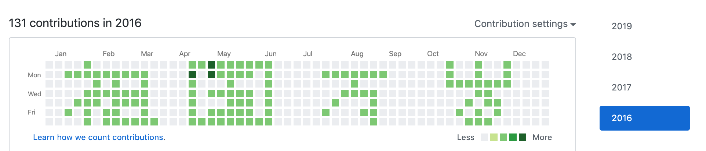
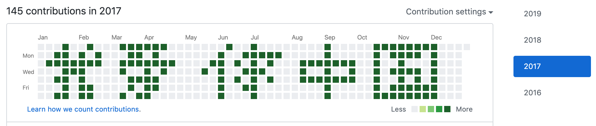
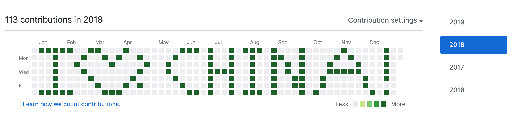

# github娱乐contributions *纯属娱乐*
用来绘制contributions的花样格式；

### win10
windows10使用powerShell，mac也可以安装并运行：
- [powerShell的安装使用](https://docs.microsoft.com/en-us/powershell/scripting/install/installing-powershell?view=powershell-6)
- 执行 `.\win_ps_build.ps1` 即可生成多次commit记录；
- 提交项目`git push`;

### mac

- 在终端中执行`bash bash-build.sh`即可；
- 提交项目`git push`;
